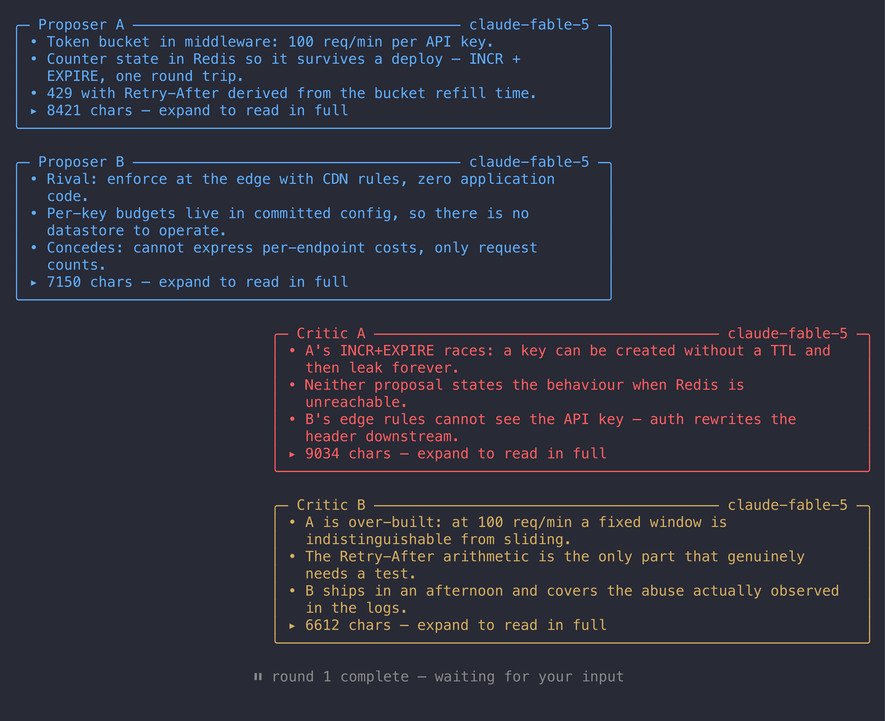

# omp-debate

An [omp](https://github.com/badlogic/pi-mono) extension that settles a plan or a review by making models argue about it, then adjudicating the argument.


With `interactive` on, the debate stops at every round boundary and waits for you — the bubbles behind the dialog are the digest, and each option carries that agent's headline for the round.



## What it does

One tool, `debate`, runs a structured adversarial debate and returns the adjudicated result:

1. **Proposers** write the strongest plan they can. With two seats, the second writes a genuinely *rival* plan rather than a variation.
2. **Critics** attack every proposal on the table. With two seats they get different assigned lenses, so they do not both report the same finding.
3. **The adjudicator** speaks once, last, reads the whole debate, and emits the final plan — adopting what survived, discarding what did not, and resolving each disagreement explicitly.

Only the adjudicator's output is returned as the result. The debate itself is visible in the transcript and in the bubbles, and once the debate finishes the verdict is rendered **in full** rather than as a summary behind the expand toggle — it is the artefact you came for.

## Usage

```
/plan-debate    add a --dry-run flag to deploy.sh
/review-debate  the retry logic I just added to the uploader
```

Both commands hand the orchestrator a steer: curate a briefing, then call the `debate` tool. The debaters have **no tools** — they see only the briefing and any files you pass, so the quality of the briefing is the quality of the debate.

The commands are named `-debate` because the interactive TUI already owns `/plan` as its plan-mode toggle. A bare `/plan` registration from an extension never fires; it is intercepted before extension dispatch.

## Install

Nothing to build: the host supplies every import at runtime.

> **Never run `bun install` in this repo.** It has no dependencies on purpose. A local `node_modules` carrying its own copy of `@oh-my-pi/*` shadows the host's module graph and breaks extension loading.

### omp

Clone it anywhere, then pick one:

```yaml
# ~/.omp/agent/config.yml
extensions:
  - ~/dev/omp-debate
```

```bash
ln -s ~/dev/omp-debate ~/.omp/agent/extensions/omp-debate   # every project
ln -s ~/dev/omp-debate .omp/extensions/omp-debate           # this project only
omp -e ~/dev/omp-debate                                     # one session
```

A directory path is enough because `package.json` declares `omp.extensions`, so the host reads the entry point instead of guessing it. Restart omp, then confirm with `bun smoke.ts` (~2 s, no tokens).

## How it works

**Every seat runs on the `@plan` role model.** Picking a cross-lineage critic automatically was tried and removed: with no capability ranking in the extension API it handed the critic a far weaker model, which produced short turns, no new findings, and factual errors the proposer had to spend its rebuttal correcting. One model arguing with itself concedes too readily, which is exactly why two rival proposers are seated whenever the budget allows.

**Seating.** `debaters` splits into proposers and critics:

| `debaters` | Proposers | Critics |
|---|---|---|
| 2 | 1 | 1 |
| 3 | 2 | 1 |
| 4 | 2 | 2 |
| 5 | 2 | 3 |
| 6 | 2 | 4 |

Two proposers are used whenever the count allows; only the floor of 2 drops to a single proposer, since otherwise there would be no critic. Critic seats 1 and 2 get named lenses (correctness/completeness/hidden coupling, and over-engineering/simplicity/failure modes); further seats are told to cover only what the others missed.

**Turn order.** Each round: every proposer, then every critic. The adjudicator speaks once, at the end. Cost is `rounds × debaters + 1` expensive calls, plus one for every agent you address at an interactive gate, plus one cheap `@smol` call per turn for the bubble summaries.

**Ultrathink** does two things: it appends an `ultrathink:` directive to the chosen seats' system prompts, and it sets the provider's reasoning effort to `max` for those calls. The second half matters more than it looks — a `modelRoles` entry like `plan: anthropic/claude-fable-5:max` loses its `:max` when the extension API resolves the alias, and the effort is not recoverable from the resolved model, so without this the debate silently ran at default effort. Ultrathink turns also get a 64 000-token output cap instead of 32 000, because thinking tokens draw from the same budget.

**Summaries.** Each turn is compressed to at most 10 bullet lines by the `@smol` model, describing only what that turn *changed*. If no cheap model resolves, or a summary call fails, the bubble falls back to head lines and says so — a debate that already cost real money is never discarded over a missing reading aid.

[`docs/harness-notes.md`](docs/harness-notes.md) records the extension-API gaps this extension ran into, with evidence and proposed fixes.

## License

MIT — see [LICENSE](LICENSE).
