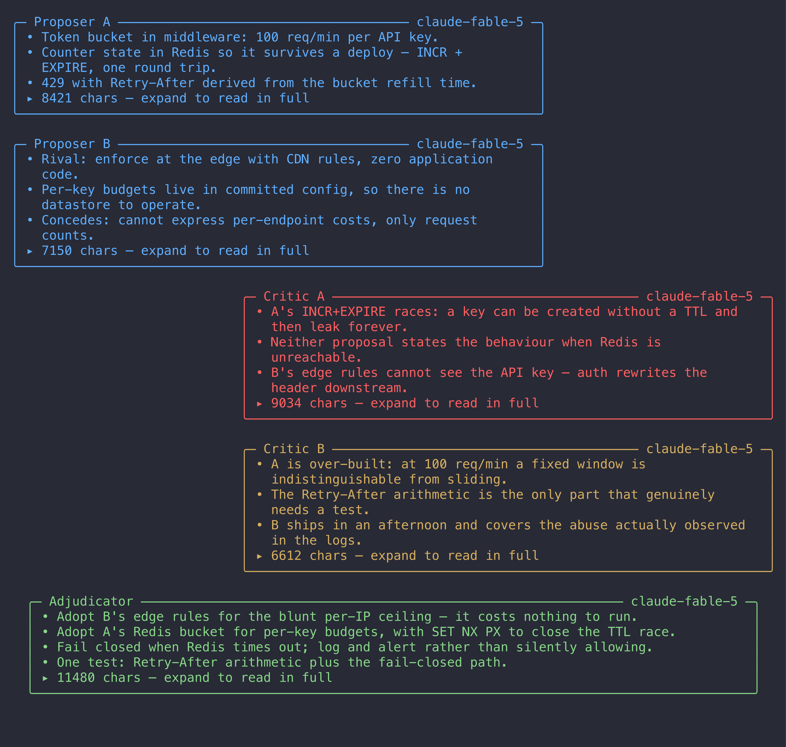
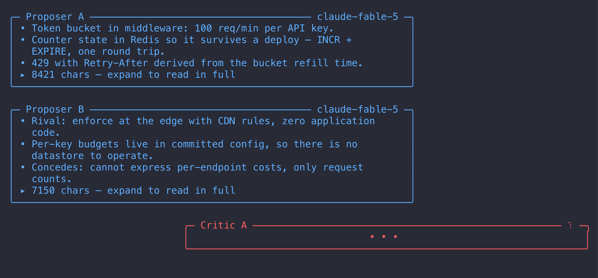

# omp-debate

An [omp](https://github.com/badlogic/pi-mono) extension that settles a plan or a review by making models argue about it, then adjudicating the argument.



While a model is thinking, its bubble shows a typing animation; the summary replaces it when the turn lands.



## What it does

One tool, `debate`, runs a structured adversarial debate and returns the adjudicated result:

1. **Proposers** write the strongest plan they can. With two seats, the second writes a genuinely *rival* plan rather than a variation.
2. **Critics** attack every proposal on the table. With two seats they get different assigned lenses, so they do not both report the same finding.
3. **The adjudicator** speaks once, last, reads the whole debate, and emits the final plan — adopting what survived, discarding what did not, and resolving each disagreement explicitly.

Only the adjudicator's output is returned as the result. The debate itself is visible in the transcript and in the bubbles.

## Install

Clone it anywhere and add the path to `extensions:` in `~/.omp/agent/config.yml`:

```yaml
extensions:
  - ~/dev/omp-debate
```

Restart omp. Confirm it loaded with `bun smoke.ts` (about 2 seconds, no tokens).

> **Never run `bun install` in this repo.** It has no dependencies on purpose. A local `node_modules` containing its own copy of `@oh-my-pi/*` shadows the host's module graph and breaks extension loading. The host supplies every import at runtime.

## Usage

```
/plan-debate    add a --dry-run flag to deploy.sh
/review-debate  the retry logic I just added to the uploader
```

Both commands hand the orchestrator a steer: curate a briefing, then call the `debate` tool. The debaters have **no tools** — they see only the briefing and any files you pass, so the quality of the briefing is the quality of the debate.

The commands are named `-debate` because the interactive TUI already owns `/plan` as its plan-mode toggle. A bare `/plan` registration from an extension never fires; it is intercepted before extension dispatch.

### Pre-flight questions

Unless the caller already specified them, the tool asks two questions before spending anything:

- **How many agents should debate?** 2 (default), 3, 4, or a custom count from 2 to 6. The adjudicator is always added on top.
- **Force maximum reasoning effort?** Adjudicator only (default), all agents, or none.

Cancelling or letting the dialog time out runs the cheap defaults (2 debaters, no ultrathink) rather than failing. Headless runs (print, RPC, ACP) never see a dialog and use the same defaults, so unattended automation cannot stall — pass `debaters` and `ultrathink` explicitly there.

### Tool parameters

| Parameter | Type | Default | Meaning |
|---|---|---|---|
| `mode` | `"plan"` \| `"review"` | required | Design a plan, or critique an implementation |
| `goal` | string | required | The original request, verbatim and unsummarised |
| `briefing` | string | required | Curated context: constraints, settled decisions, code shape |
| `files` | string[] | none | Paths included verbatim (64 KB per file, 256 KB total, then truncated with a marker) |
| `rounds` | 1–4 | 1 | Proposer/critic exchanges before adjudication |
| `debaters` | 2–6 | asked | Debating agents, excluding the adjudicator |
| `ultrathink` | `"none"` \| `"adjudicator"` \| `"all"` | asked | Which seats run at maximum reasoning effort |

## How it works

**Every seat runs on the `@plan` role model.** Picking a cross-lineage critic automatically was tried and removed: with no capability ranking in the extension API it handed the critic a far weaker model, which produced short turns, no new findings, and factual errors the proposer had to spend its rebuttal correcting. One model arguing with itself concedes too readily, which is exactly why two rival proposers are seated whenever the budget allows.

**Seating.** `debaters` splits into proposers and critics:

| `debaters` | Proposers | Critics |
|---|---|---|
| 2 | 1 | 1 |
| 3 | 2 | 1 |
| 4 | 2 | 2 |
| 5 | 2 | 3 |
| 6 | 2 | 4 |

Two proposers are used whenever the count allows; only the floor of 2 drops to a single proposer, since otherwise there would be no critic. Critic seats 1 and 2 get named lenses (correctness/completeness/hidden coupling, and over-engineering/simplicity/failure modes); further seats are told to cover only what the others missed.

**Turn order.** Each round: every proposer, then every critic. The adjudicator speaks once, at the end. Cost is `rounds × debaters + 1` expensive calls, plus one cheap `@smol` call per turn for the bubble summaries.

**Ultrathink** does two things: it appends an `ultrathink:` directive to the chosen seats' system prompts, and it sets the provider's reasoning effort to `max` for those calls. The second half matters more than it looks — a `modelRoles` entry like `plan: anthropic/claude-fable-5:max` loses its `:max` when the extension API resolves the alias, and the effort is not recoverable from the resolved model, so without this the debate silently ran at default effort. Ultrathink turns also get a 64 000-token output cap instead of 32 000, because thinking tokens draw from the same budget.

**Summaries.** Each turn is compressed to at most 10 bullet lines by the `@smol` model, describing only what that turn *changed*. If no cheap model resolves, or a summary call fails, the bubble falls back to head lines and says so — a debate that already cost real money is never discarded over a missing reading aid.

## Rendering

Bubbles are laid out like a chat: proposers flush left, critics flush right, both at 70% of the width. The adjudicator's verdict is the artefact you actually read, so it spans everything but a two-column margin. Two critics get different colours so their seats are distinguishable at a glance.

A turn in flight shows only a header and a thinking animation — dots appearing and disappearing one at a time. Streaming the raw text was unreadable at generation speed, and the animation keeps moving during long silent thinking pauses because the tool re-emits on a 300 ms heartbeat. Press the expand toggle on a finished result to replace every summary with the full turn text.

Below 72 columns the side layout collapses to full-width gutter blocks; below 24 columns it degrades to plain unstyled lines.

## Development

No build step and no dependencies. The two pure modules carry their own assertion suites and run under plain `bun`:

```bash
bun core.ts       # orchestration: seating, turn order, prompts, transcript integrity
bun render.ts     # layout: bubble geometry, dot phases, width invariants
bun smoke.ts      # + host tool/command registration (~2 s, no tokens)
bun smoke.ts --live   # + one real debate driven through /plan-debate (2-5 min, real tokens)
```

`core.ts` and `render.ts` deliberately contain no *value* imports from the host packages — only type-only ones — which is what keeps them runnable outside omp. Host wiring lives entirely in `index.ts`.

Regenerate the screenshots after a layout change:

```bash
brew install charmbracelet/tap/freeze
freeze --execute "bun shots.ts done"      -o docs/debate.png           --theme dracula --padding 12 --font.family Menlo
freeze --execute "bun shots.ts streaming" -o docs/debate-streaming.png --theme dracula --padding 12 --font.family Menlo
```

An explicit monospace `--font.family` is required: freeze's fallback font renders box-drawing characters at a different advance width and the bubbles visibly break.

[`docs/harness-notes.md`](docs/harness-notes.md) records the extension-API gaps this extension ran into, with evidence and proposed fixes.

## License

MIT — see [LICENSE](LICENSE).
